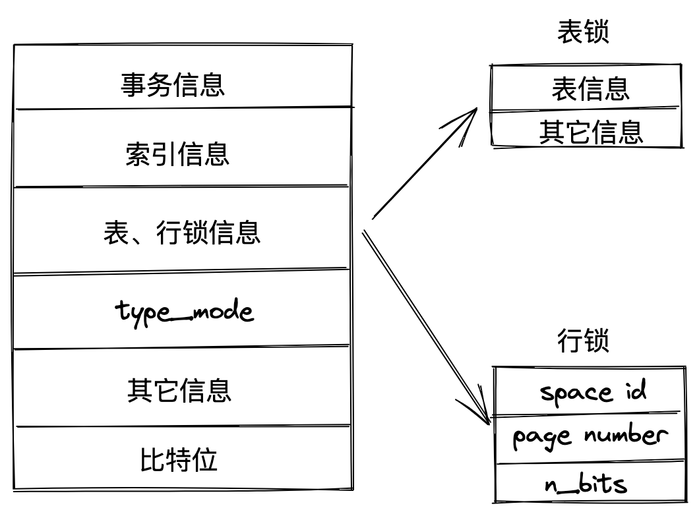

# MySQL 锁学习、总结

以下实验、练习均在`MySQL8.0`上进行，8.0 是MySQL的一个重大版本，虽然用的人较少。

数据库版本：

```sh
Server version: 8.0.27
```

## 锁分类

按照数据操作类型来划分：

- 读锁/共享锁
- 写锁/拍他锁

读锁，又称共享锁，英文简称S，指对于同一份数据，多个读事务可以  
同时读取，互补影响。

写锁，又称拍他锁(独占)，英文简称X，指一个写事务获取到数据的写  
权限后，其它事务都只能等待它完成后才能获取数据。

对于InnoDB引擎，读、写锁既可以用在表上，也可以用在行上。

按照对锁的态度来划分：

- 乐观锁(版本控制，重试)
- 悲观锁

按照加锁方式来划分：

- 隐式锁
- 显式锁

按照锁的粒度来划分：

- 全局锁
- 表级锁
    - S锁
    - X锁
    - 意向锁
    - 自增锁
    - MDL锁
- 行级锁
    - record lock
    - gap lock
    - next-key lock
    - 插入意向锁
- 页级锁

其它类型：

- 死锁
- 活锁

### 表锁(table lock)

在对某个表执行`alter`，`drop`等DDL操作时，其它在该表上的事务均会  
被阻塞，这正是由 server 层的元数据锁(metadata lock, MDL)来保证的。

MDL是自发加锁的，如果需要对表显示加锁，可以使用`lock tables`命令：

```sh
lock tables t read;
lock tables t write;
```

### 意向锁(intention lock)

意向锁是一种隐式的表级锁，由存储引擎自动加锁并自动解锁，它主要分为如下两种：

- 意向共享锁(intention shared lock，IS)：事务想要获取某些行的`S`锁，必须  
  先获得表的IS锁。
- 意向拍他锁(intention exclusive lock，IX)：事务想要获取某些行的`X`锁，  
  必须先获得表的IX锁。

意向锁的关键在于，它可以与行级锁共存，当获取到意向锁后也只是表达出想要  
获取行锁的意向，并不会阻塞行锁，这样仍能保证行锁的正常运行。

### 元数据锁(metadata lock)

当对一个表做增删查改的时候，加 MDL读锁；当对表结构做变更的时候，加MDL写锁。

### 记录锁(record lock)

针对一条数据记录的锁，当一个事务获取了一条记录的S型记录锁后，其他事务也可以继续获取该记录的S型记录锁，  
但不可以继续获取X型记录锁; 当一个事务获取了一条记录的X型记录锁后，其他事务既不可以继续获取该记录的S型记录锁，  
也不可以继续获取X型记录锁。

### 间隙锁(gap lock)

用来解决幻读问题，为了防止插入幻影记录而提出的；被加锁的区间，如(3,8)在锁未解开之前  
是无法插入新记录的。

> 可重复读级别下才生效。

### 临键锁(next-key lock)

有时候既想锁住某条记录，又想阻止其他事务在该记录前插入新记录；可以理解为记录锁+间隙锁。

### 插入意向锁(insert intention lock)

一个事务在插入一条记录时需要判断一下插入位置是不是被别的事务加了间隙锁，如果有的话，插入操作需要等待，  
直到拥有间隙锁的事务提交。但是InnoDB规定事务在等待的时候也需要在内存中生成一个锁结构，  
表明有事务想在某个间隙中插入新记录，但是正在等待；这种锁被称为插入意向锁。

### 页锁

页锁就是在页的粒度上进行锁定，锁定的数据资源比行锁要多，因为一个页中可以有多个行记录。

### 全局锁

对整个数据库实例进行加锁，让整个库处于已读状态，可以使用这个命令之后   
其他线程的以下语句会被阻塞：数据更新语句(数据的增删改)、数据定义语句(包括建表、修改表结 构等)和  
更新类事务的提交语句。

主要用于全库备份。

## 锁结构

锁在存储引擎中的结构图如下：



- 事务信息：那个事务生成了锁结构
- 索引信息：对于行锁，需要记录加锁是对那个索引的
- 表锁、行锁信息：
    - 表锁：记录对那个表加锁
    - 行锁：
        - space id：表空间
        - page number：页号
- type_mode：
    - lock_mode：锁模式，比如 IS锁、S锁、X锁等
    - lock_type：锁类型，lock_table表级锁，lock_rec，行级锁
- rec_lock_type：行锁时有更多的类型
    - lock_ordinary：next-key锁
    - lock_gap：gap 锁
    - so on...
- 其它信息
- 比特位：映射数据

## 锁监控

对于行级锁，可以通过`innodb_row_lock`等状态来查看锁的竞争情况：

```sh
mysql> show status like 'innodb_row_lock%';
+-------------------------------+-------+
| Variable_name                 | Value |
+-------------------------------+-------+
| Innodb_row_lock_current_waits | 0     |
| Innodb_row_lock_time          | 0     |
| Innodb_row_lock_time_avg      | 0     |
| Innodb_row_lock_time_max      | 0     |
| Innodb_row_lock_waits         | 0     |
+-------------------------------+-------+
5 rows in set (0.02 sec)
```

- Innodb_row_lock_current_waits：当前正在等待锁定的数量
- Innodb_row_lock_time：从系统启动到现在锁定总时间长度
- Innodb_row_lock_time_avg：每次等待所花平均时间
- Innodb_row_lock_time_max：从系统启动到现在等待最常的一次所花的时间
- Innodb_row_lock_waits：系统启动后到现在总共等待的次数

MySQL将事务、锁等信息记录在`information_schema`库中，可以分别查看`INNODB_TRX`、
`INNODB_LOCKS`和`INNODB_LOCK_WAITS`来查看。

比如：

查询正在被锁阻塞的sql语句：

```sql
SELECT *
FROM information_schema.INNODB_TRX
```

查询锁等待情况：

```sql
SELECT *
FROM performance_schema.data_lock_waits;
```

查询锁的情况：

```sql
SELECT *
FROM performance_schema.data_locks;
```


